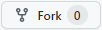
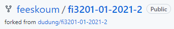
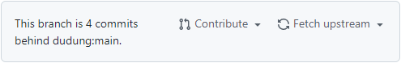
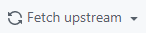
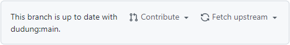
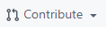
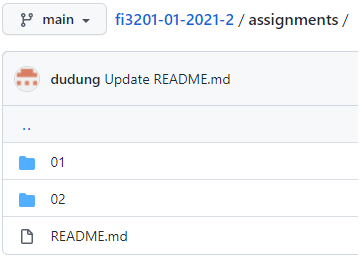
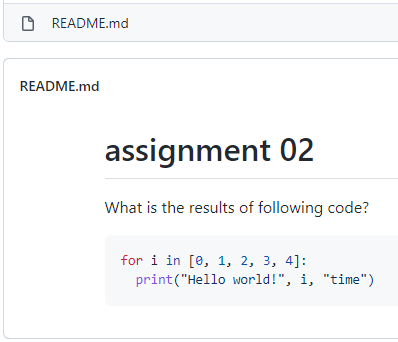
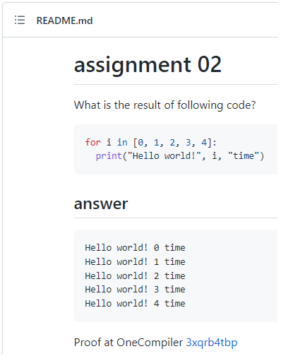
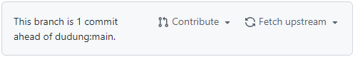

# fi3201-01-2021-2
Assignment for FI3201 Computational Physics Class 01 Semester 2 Year 2021/2022

## fork repository
1. Fork this repository to your reposity and edit it there using  button. \
  Then you will get a fork of this repository under your github acccount, e.g. \
  
2. Once the source is updated ([dudung/fi3201-01-2021-2](https://github.com/dudung/fi3201-01-2021-2)) it will appear that your repository (this branch) `n` commits behind main as follows \
  
3. Resolve this or update your local copy using the  button and choose , then you will get \
  
4. Do not use . This will be used only once at the end of semester for merging all changes in your local reposity to the main. You will be notified when to do this.

## work with the assignments
1. Navigate to [assignments folder](assignments).
2. Choose assigment to work with, e.g [02](assignments/02) \
  
3. Navigate to the folder \
   \
  and read the instruction.
4. Make a folder with your NIM, copy the `README.md` containing the instruction, and edit it with your answer. \
  
5. After that you will have notification that this branch (your local repository) is `n` commits a head of main ([dudung/fi3201-01-2021-2](https://github.com/dudung/fi3201-01-2021-2)) \
   \
  and tt is ok and do nothing about it.
