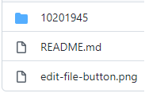

# assignment 01
Create a new folder using your NIM and create a file named `README.md` in the folder with following content

```
NAME <fill your name>
NIM  <fill your student identification number>
```

## notes
1. Open this file with  but do not modify anything.
1. Just copy the above assigment and paste it to the `README.md` file.
2. Make section with the name `## answer` and write your answer below it. 
3. You will work with other assignments with the same way.
4. See the example by [feeskuom](https://github.com/feeskoum) on [10201945](10201945) folder. \
  Above you can see that there is a folder with a NIM as an example. \
  
5. You will make the second folder with your NIM and put your answer in it along with a `README.md` file.
