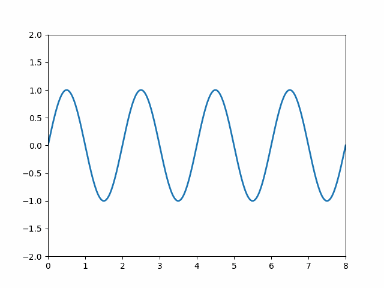

# assignment 04

**Content:**
- [Question 1](#q1)
- [Question 2](#q2)
- [Question 3](#q3)
- [Question 4](#q4)
<br>
<br>

Terdapat kode Python berikut

```python
"""
Matplotlib Animation Example

author: Jake Vanderplas
email: vanderplas@astro.washington.edu
website: http://jakevdp.github.com
license: BSD
Please feel free to use and modify this, but keep the above information. Thanks!
"""

import numpy as np
from matplotlib import pyplot as plt
from matplotlib import animation

# First set up the figure, the axis, and the plot element we want to animate
fig = plt.figure()
ax = plt.axes(xlim=(0, 2), ylim=(-2, 2))
line, = ax.plot([], [], lw=2)

# initialization function: plot the background of each frame
def init():
    line.set_data([], [])
    return line,

# animation function.  This is called sequentially
def animate(i):
    x = np.linspace(0, 2, 1000)
		
		# ---- equation of y ----
		
		# -----------------------
		
    line.set_data(x, y)
    return line,

# call the animator.  blit=True means only re-draw the parts that have changed.
anim = animation.FuncAnimation(fig, animate, init_func=init,
                               frames=200, interval=20, blit=True)

# save the animation as an mp4.  This requires ffmpeg or mencoder to be
# installed.  The extra_args ensure that the x264 codec is used, so that
# the video can be embedded in html5.  You may need to adjust this for
# your system: for more information, see
# http://matplotlib.sourceforge.net/api/animation_api.html
#anim.save('basic_animation.mp4', fps=30, extra_args=['-vcodec', 'libx264'])

#plt.show()


# lines above this line is the original code from Jake Vanderplas
# url https://jakevdp.github.io/downloads/code/basic_animation.py

# modification from Sparisoma Viridi 2022-03-29
option = 1

if option == 0:
	writergif = animation.PillowWriter(fps=30)
	anim.save('basic_animation.gif', writer=writergif)
# anim.save('basic_animation.mp4', fps=30, extra_args=['-vcodec', 'libx264'])
else:
	plt.show()


```
yang dapat diperoleh di <https://jakevdp.github.io/downloads/code/basic_animation.py>.

<br>
<br>

## question 1 <a name="q1"></a>
Baca penjelasan mengenai kode di atas pada <https://dudung.github.io/bugx/0026/> atau pada pertemuan kuliah terkait.

### answer 1
Apakah penjelasan kode dia atas sudah dibaca atau hadir pada kuliah?
```
Sudah
```

<br>
<br>

## question 2 <a name="q2"></a>
Modifikasi program yang diberikan sehingga dapat menggambarkan gelombang yang merambat ke kanan dengan panjang gelombang &lambda; = 2 m dan periode T = 2 s. Perolehlah pula berkas gif hasilnya.

### answer 2
Persamaan gelombang merambat ke kanan
<!-- $$
y(x) = A sin(kx - \omega t + \phi)
$$ --> 

<div align="center"></div>

untuk &lambda; = 2m dan T = 2s, maka
$$
k = \frac{2 \pi}{\lambda} = \frac{2 \pi}{2} = \pi
$$
$$
\omega = \frac{2 \pi}{T} = \frac{2 \pi}{2} = \pi
$$

untuk &Phi; = 0, diperoleh
$$
y(x) = A sin(\pi x - \pi t + \phi)
$$


Potongan kode yang perlu disisipkan adalah
```py
# definisikan y di funsi animate(i)
def animate(i):
    x = np.linspace(0, 2, 1000)
    y = np.sin(2 * np.pi * (np.pi*x - np.pi*i))     # move to the right
    line.set_data(x, y)
    return line,


# ubah option menjadi 0 untuk menghasilkan file.gif
option = 0
if option == 0:
    writergif = animation.PillowWriter(fps=60)
    f_name = 'wave_right.gif'
    anim.save(f_name, writer=writergif)
else:
	plt.show()


# karena file.gif disimpan di workspace_path, pindah ke current_path
src_path = os.getcwd() + '\\' + f_name      # in ~/FI3201-01-2021-2
dst_path = os.path.dirname(os.path.abspath(__file__)) + '\\' + f_name
shutil.move(src_path, dst_path)
```
File program dapat dilihat [di sini.](q2_right.py)

Hasil berkas gifnya adalah \


<br>
<br>

## question 3 <a name="q3"></a>
Modifikasi program yang diberikan sehingga dapat menggambarkan gelombang yang merambat ke kiri dengan panjang gelombang &lambda; = 2 m dan periode T = 2 s. Perolehlah pula berkas gif hasilnya.

### answer 3
Persamaan gelombang merambat ke kiri
$$
y(x) = A sin(kx + \omega t + \phi)
$$

Untuk &lambda; = 2m, T = 2s, dan &Phi; = 0, diperoleh
$$
y(x) = A sin(\pi x + \pi t + \phi)
$$

Potongan kode yang perlu disisipkan adalah
```
# dilakukan hal sama seperti pada question2
# tapi, definisi y yang digunakan

y = np.sin(2 * np.pi * (np.pi*x + np.pi*i))     # move to the left

```
File program dapat dilihat [di sini.](q3_left.py)

dan hasil berkas gifnya adalah \


<br>
<br>

## question 4 <a name="q4"></a>
Modifikasi program yang diberikan sehingga dapat menggambarkan gelombang stasioner yang tidak merambat dengan panjang gelombang &lambda; = 2 m dan periode T = 2 s. Perolehlah pula berkas gif hasilnya.

### answer 4
Persamaan gelombang stasioner
$$
y(x,t) = B sin(kx) cos(\omega t - \phi)
$$

Untuk &lambda; = 2m, T = 2s, dan &Phi; = 0, diperoleh
$$
y(x,t) = B sin(\pi x) cos(\pi t)
$$

Potongan kode yang perlu disisipkan adalah
```
# definisi y yang digunakan
y = np.sin(np.pi*x) * np.cos(np.pi*i)       # y for stationer wave

```
File program dapat dilihat [di sini.](q4_stationer.py)

Hasil berkas gifnya adalah \

