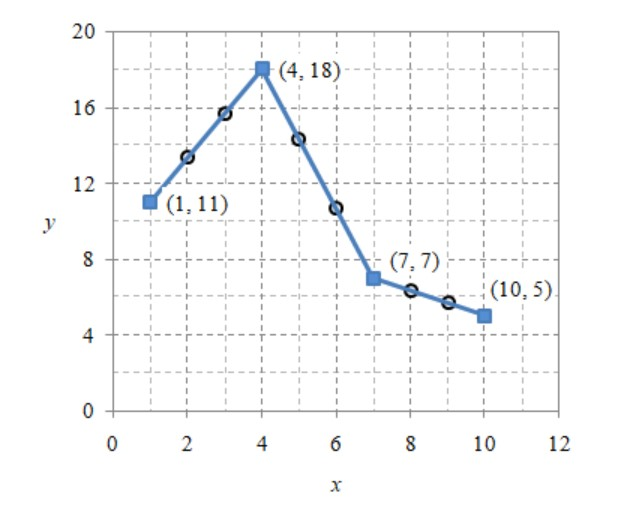
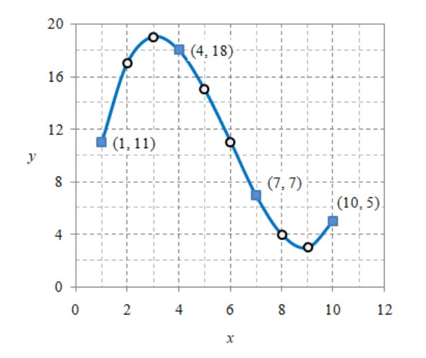

# Interpolasi

## Table of Contents

- [About](#about)
- [Note](#note)
- [Problem](#problem)


## About <a name = "about"></a>

Materials:
- Interpolation
- Linear interpolation
- Polynomial interpolation

Material for 6th of weeks.

## Note <a name = "note"></a>
1. **Linear Interpolation**\
    See the code at [here](0501-lin-inter.py).
    
    Output:
    ```python
    1 11.0
    2 13.333333333333332
    3 15.666666666666666
    4 18.0
    5 14.333333333333332
    6 10.666666666666664
    7 7.0
    8 6.333333333333333
    9 5.666666666666666
    10 5.0
    ```
    Compiled at local.

    Data at x={1,4,7,10} is the original. The other are interpolation result.\
    

2. **Polynomial Interpolation**\
    See the code at [here](0502-lagrange-inter.py).
    Output:
    ```python
    1 11.000
    2 17.000
    3 19.000
    4 18.000
    5 15.000
    6 11.000
    7 7.000
    8 4.000
    9 3.000
    10 5.000
    ```
    Compiled at local.

    

## Problem <a name = "problem"></a>

