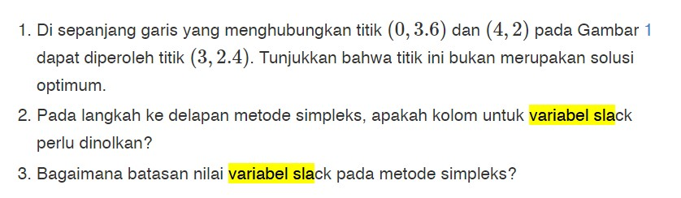
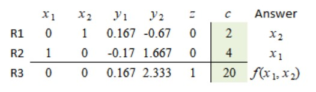
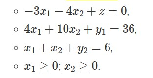
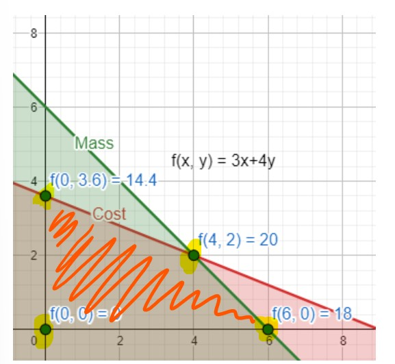
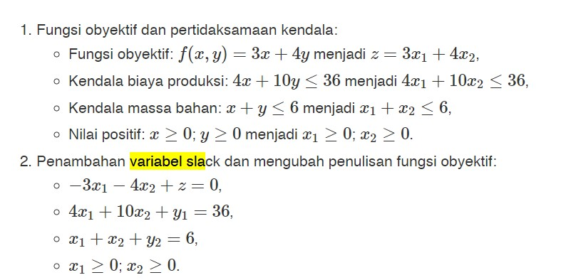

# M4 Linear Programming

## Table of Contents

- [About](#about)
- [Getting Started](#getting_started)
- [Usage](#usage)
- [Contributing](../CONTRIBUTING.md)

## About 

linear programming

## Getting Started 

Check [link](https://bugx.vercel.app/pages/0451.html)

## Problem

### Soal 1

Gunakan simplex method untuk cari titik optimum. 
Titik optimum (4.2)
Jadi, (3, 2.4) bukan titik optimum.

### Soal 2

> Variable slack: y1 y2 z

Kondisi maksimum itu saat `x1,x2 >= 0` (lihat R3) \
Saat variabel slack nol, kondisi itu tidak terpenuhi.

### Soal 3
Variabel slack adalah variabel yang ditambahkan ke model matematik kendala untuk mengkonversikan pertidaksamaan ≤ menjadi persamaan (=).

Jika, variabel slack = 0, berarti kendala tidak di kondisi maksimum.

Perhatikan bahwa saat semua variabel slack = 0 --> maksimum
