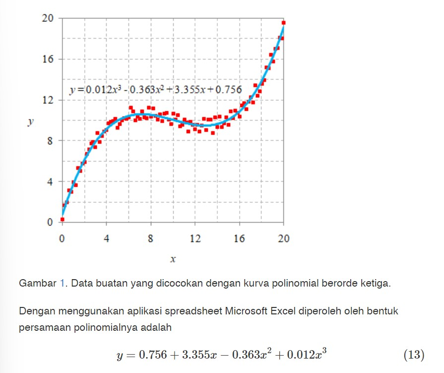

# QUADRATIC PROGRAMMING

## Table of Contents

- [About](#about)
- [Answer](#answer)
- [Problem](#problem)

## About 

Contents of lecture are:
- Formula
- Least square
    - Linear regression

It can be accessed at [here](https://bugx.vercel.app/pages/0452.html).

## Answer 

> **Soal 1**
1. Question

    Answer

## Problem 

Akan dilakukan optimasi suatu fungsi obyektif kuadratik yang tunduk pada kendala linear.

Ada data mentah [0452-a.txt](0452-a.txt).

Dengan menggunakan excel, diperoleh \

Dengan Python:\
Manfaatkan [Pers.12](https://bugx.vercel.app/pages/0452.html#:~:text=dengan%20nol%20untuk-,meminimumkannya,-%E2%88%82).

Program ada di [sini](0452-qp-ls-lr-poly3.py).