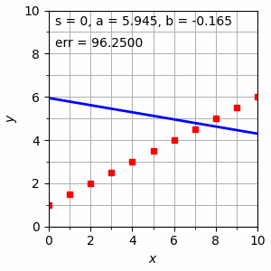

# Simple Linear Regression

## Table of Contents

- [About](#about)
- [Note](#note)
- [Problem](#problem)


## About <a name = "about"></a>

Contents of lecture are:
- slr ls
- str ls gradient descent

It can be accessed at [link](https://bugx.vercel.app/pages/0212.html) or [Fiskom M5](https://1drv.ms/u/s!An8rTGgjOQ80oAq4P3AtWA4tm9cM).


## Note <a name = "note"></a>

> slr ls gradient descent \

Code is [here](slr_ls_gradient_descent.py).



In default, animation will saved in workspace folder. So, do like this
```python
ani.save('exercises/slr/0267.gif', writer=writergif)
```


## Problem <a name = "problem"></a>

> **Q1**
1. Tentukan nilai a dan b pada contoh program yang diberikan saat step s = 520. \
    Add this function.
    ```python
    def saat_si(a, b, s):
	si =520
	if (s == si):
		print('Saat step s = ', si)
		print('a = ', format(a, '.4f'))
		print('b = ', format(b, '.4f'))
    ```

    Call it after decrement of s, inside of `animate(i)` function.
    ```python
    s = i - 1
	saat_si(a, b, s)	# print nilai a, b saat s
    ```

    Output:
    ```python
    Saat step s = 520
    a = 1.199
    b = 0.471
    ```
